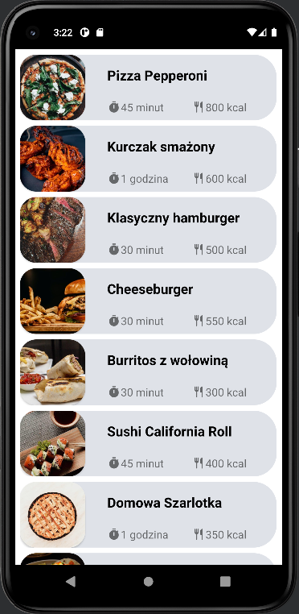
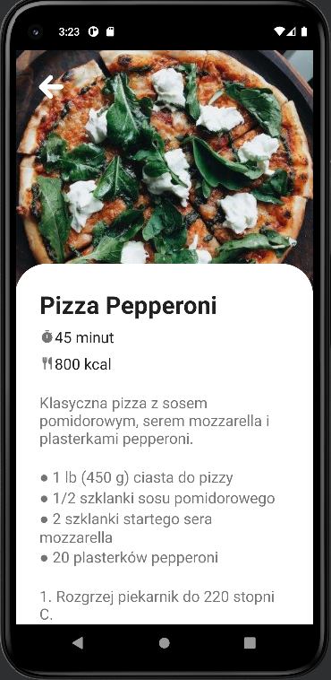
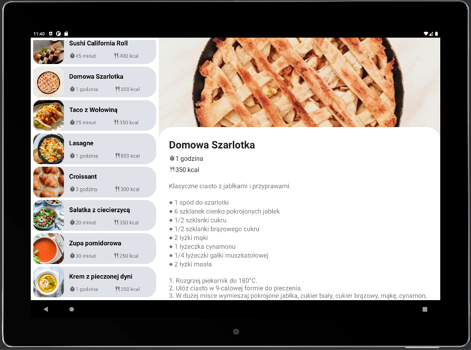

# Cookbook app
Mobile development uni course assignment.

## Mobile view

## Tablet view

## To do:
- [x] Aplikacja ma składać się z dwóch aktywności: głównej wyświetlającej listę potraw oraz aktywności szczegółów uruchamianej po kliknięciu wybranej potrawy z listy i wyświetlającej co najmniej listę składników oraz sposób przygotowania potrawy

- [x] Aplikacja ma korzystać z fragmentów

- [x] Aplikacja powinna mieć wersję układu dla smartfonów i osobną dla tabletów

- [x] Aplikacja powinna działać poprawnie po zmianie orientacji urządzenia

- [x] Źródło danych o przepisach inne niż tablica. Może to być na przykład baza danych lub usługa internetowa

- [x] Kod aplikacji w Kotlinie

- [x] Informacja o kaloryczności potrawy

- [x] We fragmencie szczegółów należy zagnieździć fragment dynamiczny minutnika

- [x] Minutnik ma wyświetlać czas z dokładnością do sekundy

- [x] Minutnik powinien działać poprawnie na smartfonach i tabletach

- [x] Minutnik powinien działać poprawnie po zmianie orientacji urządzenia

- [x] Minutnik powinien mieć przyciski: start, stop, przerwij

- [x] Osiągnięcie wartości zerowej ma być odpowiednio sygnalizowane. Do wyboru co najmniej jedna z opcji: wizualnie, dźwiękowo, wibracjami.

- [x] Ponadto minutnik ma mieć jedną z dwóch funkcji do wyboru:
- ma automatycznie ustawić pierwszy czas z przepisu, a po odliczeniu tego czasu do końca i reakcji użytkownika automatycznie ustawić kolejny czas z przepisu
- ma mieć możliwość ustawienia czasu przed uruchomieniem odliczania

- [ ] Karty kategorii zamiast listy nazw potraw mają używać widoku RecyclerView z układem siatki (grid), w którym poszczególne pozycje (potrawy) będą prezentowane w postaci obrazka i nazwy, dla których użyto widoku CardView. Kliknięcie wybranej pozycji (potrawy) powoduje wyświetlenie szczegółów, czyli nazwy potrawy, większego obrazka, listy składników i sposobu przygotowania.

- [ ] Na ekranie szczegółów ma się pojawić przycisk FAB (floating action button), który będzie odpowiedzialny za przesłanie listy składników do innej aplikacji (w uproszczonej wersji działanie przycisku może prowadzić jedynie do wyświetlenia odpowiedniego komunikatu).

- [ ] W aplikacji należy zastosować motywy.

- [ ] W aplikacji należy korzystać z fragmentów.

- [ ] Aplikacja ma działać poprawnie przy zmianie orientacji urządzenia.

- [ ] Każda aktywność ma mieć pasek aplikacji w postaci paska narzędzi.

- [ ] Ekran szczegółów ma być przewijany w pionie razem z paskiem aplikacji.

- [ ] Na ekranie szczegółów obrazek ma się pojawić na pasku aplikacji, ale ma się razem z nim zwijać.

- [ ] Przechodzenie pomiędzy kartami ma się odbywać także za pomocą gestu przeciągnięcia.

- [ ] Dodanie krótkiej animacji, która będzie się pojawiać w trakcie uruchamiania aplikacji. Animacja powinna być związana tematycznie z realizowanym zadaniem.

- [ ] Animacja ma się opierać na systemie animacji właściwości, czyli korzystać z obiektu ObjectAnimator
